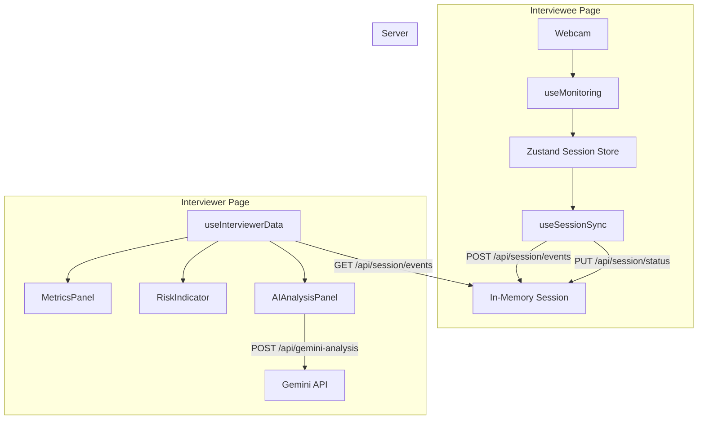
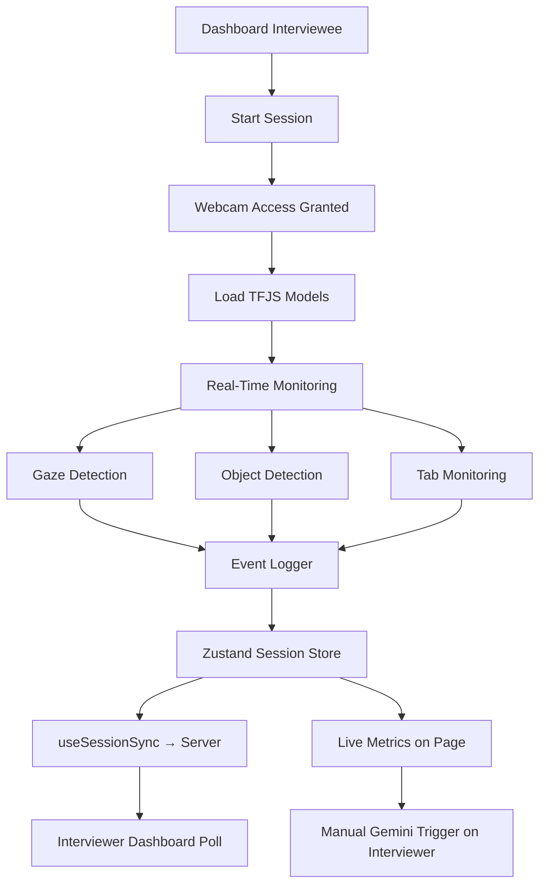

# OAPS — Final System Architecture

## Authentication Flow

```mermaid
flowchart LR
  subgraph auth [Authentication]
    A[Login / Signup Page] --> B[API: /api/auth/login or signup]
    B --> C{MongoDB}
    C --> D[JWT in httpOnly Cookie]
    D --> E[Middleware]
    E --> F{role?}
    F -->|interviewer| G[/interviewer]
    F -->|interviewee| H[/interviewee]
    F -->|no token| A
  end
```

- **Signup**: name, email, password, role (interviewer | interviewee). Password hashed with bcrypt; user stored in MongoDB `users` collection. JWT set in httpOnly cookie.
- **Login**: email + password validated; JWT set in cookie.
- **Middleware**: Protects `/`, `/interviewer`, `/interviewee`. Redirects unauthenticated users to `/login`. Blocks cross-role access (interviewer cannot access `/interviewee`, and vice versa).

## Data Flow: Interviewee → Server → Interviewer



- **Interviewee**: Starts session → webcam and TensorFlow.js run on this page only. Events and risk score (and focusRatio) are synced to the server every ~500ms via `useSessionSync`. Session status (start/end/reset) is sent via PUT to `/api/session/status`.
- **Server**: In-memory session store holds events, riskScore, focusRatio, and session timestamps. No database for session data; single process only.
- **Interviewer**: Polls GET `/api/session/events` every ~1s via `useInterviewerData`. Displays metrics, risk, event log, and can trigger Gemini AI report from the aggregated payload.

## Monitoring Pipeline (Interviewee Page Only)



- Webcam and AI monitoring run only on the **interviewee** page. Camera and models are disposed when the user leaves the page or ends the session.
- Risk score is computed locally (risk-calculator); Gemini is invoked only from the **interviewer** page with a summarized payload.

## Environment Variables

| Variable       | Purpose                          |
|----------------|----------------------------------|
| `GEMINI_API_KEY` | Google Gemini API (server-side)  |
| `MONGODB_URI`  | MongoDB Atlas connection string  |
| `JWT_SECRET`   | Secret for signing JWTs (min 32 chars) |
